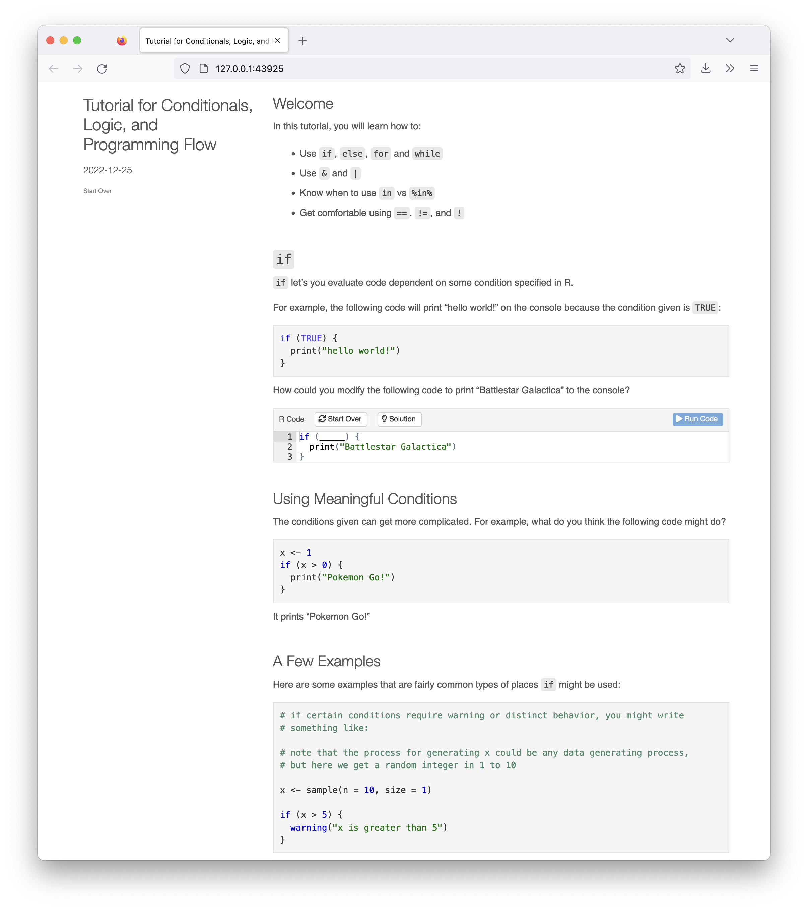

This is a package that makes it easy to run the interactive tutorials for the
*ID529 Data Management and Analytic Workflows* course. 

```r
# install devtools if you haven't already
install.packages("devtools")

# to install the ID529tutorials package
library(devtools)
devtools::install_github("ID529/ID529tutorials")
```

A list of the tutorials contained in the package is made available by running: 

```{r, eval=F}
library(ID529tutorials)
available_tutorials("ID529tutorials")
```

```txt
Available tutorials:
* ID529tutorials
  - logic : "Tutorial for Conditionals, Logic, and Programming Flow" 
```

A tutorial can be run with the `run_tutorial` command, as in: 

```r
run_tutorial(name = 'logic', package = 'ID529tutorials')
```

That will open up an interactive tutorial that looks like this:



These tutorials and this package are provided freely under the MIT license. 
